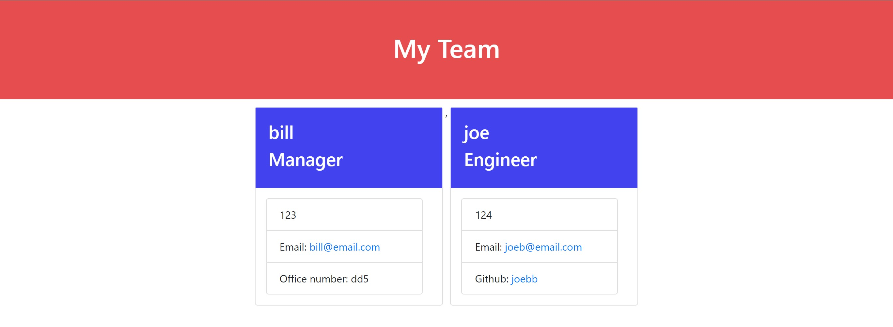
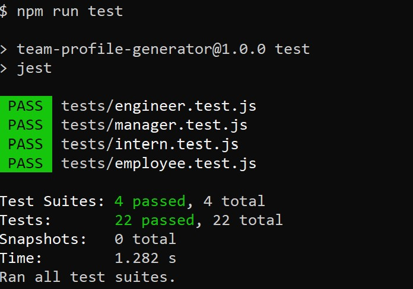
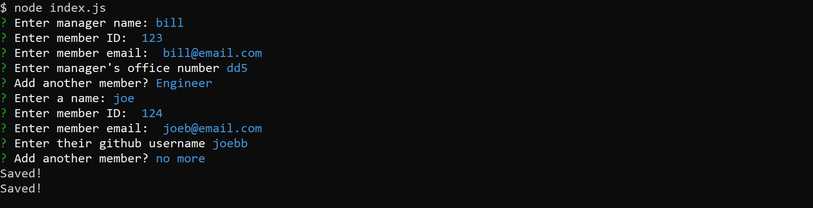

# team-profile-generator

## Description 
The following is an application that allows the user to create a webpage that has Team member information. Team member information will include name, email, id, and a unique property related to their role. When the user runs the index.js file they will then be prompted with questions; after the user finishes inputing all of the team member the application will then begin creating an html and css file. Once the html and css file are generated the user can then open them within a browser of their choice. 

# Table of Contents
- [Instructions](#instructions)
- [Test](#test)
- [Requirments](#requirements)
- [License](#license)
- [Credits](#credits)

## Instructions
Start off by clone the repository in your terminal, once this is done navigate within the folder.
  

## Test
* Type "npm install", this will download the required files to run jest and inquirer
* Then type "npm run test", this will run a test to make sure that each class file is functioning properly
  

  

* Next type "node index.js", this will run the application and allow the user to answer questions
* Once the user had added all of the team member confirm the "no more" when promted to add new members.
  

 
  

* Now open the the cloned repository within a IDE of your choice
* Navigate to the index.html file within the dist/ folder and open the file in browser. This is the completed webpage.

## Requirements
* IDE (preferably VS code)
* Node.js (to run the application in the terminal)

## Walkthrough Video
* [click here](https://drive.google.com/file/d/1ZdwRJPKCaqQqMyL2ZUg0kRE3X8GpbCnZ/view)

## Technologies
* Node.js
* Jest.js
* Inquirer.js

## Credits
Richard Ferry
* [Email](mailto:richardfpro864@gmail.com)
* [Github](https://github.com/rich-f-p)
* [LinkedIn](https://www.linkedin.com/in/richard-ferry-83120514b/)

## License
* [License: MIT](https://opensource.org/licenses/MIT) : click to learn more